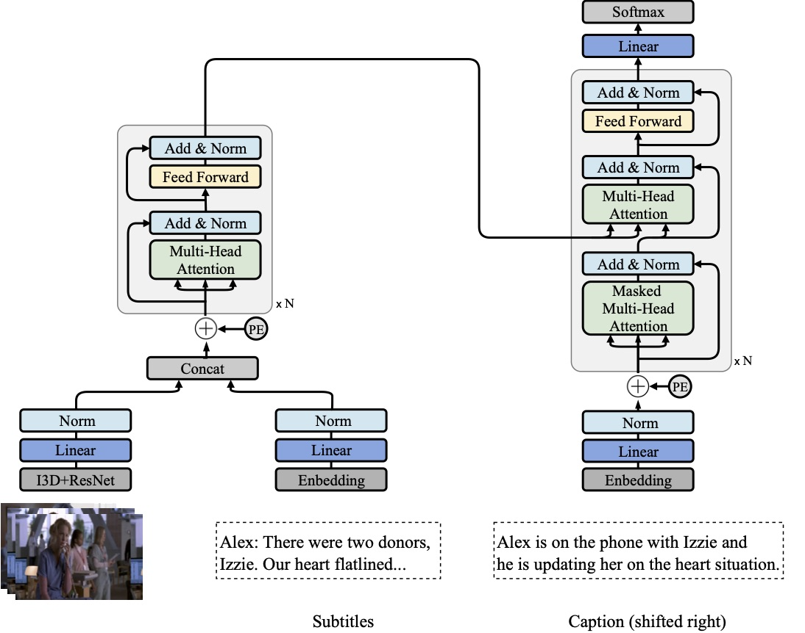

TVCaption
===
PyTorch implementation of MultiModal Transformer (MMT), a method for multimodal (video + subtitle) captioning.

[TVR: A Large-Scale Dataset for Video-Subtitle Moment Retrieval](https://arxiv.org/abs/2001.09099)

[Jie Lei](http://www.cs.unc.edu/~jielei/), [Licheng Yu](http://www.cs.unc.edu/~licheng/),
[Tamara L. Berg](http://tamaraberg.com/), [Mohit Bansal](http://www.cs.unc.edu/~mbansal/)


<p align="center" >
  
</p>


## Resources
- Data: [TVC dataset](./data/)
- Website (with leaderboard): [https://tvr.cs.unc.edu/tvc.html](https://tvr.cs.unc.edu/tvc.html)
- Submission: [codalab evaluation server](https://competitions.codalab.org/competitions/23109)
- Related works: [TVR (Moment Retrieval)](https://github.com/jayleicn/TVRetrieval), [TVQA (Localized VideoQA)](https://github.com/jayleicn/TVQA), [TVQA+ (Grounded VideoQA)](https://github.com/jayleicn/TVQAplus)

## Getting started
### Prerequisites
0. Clone this repository
```
git clone --recursive https://github.com/jayleicn/TVCaption.git
cd TVCaption
```

1. Prepare feature files
Download [tvc_feature_release.tar.gz ](https://drive.google.com/file/d/1bSjxbKSxp1qEBCSwAmk8YlkRl1ztgrWO/view?usp=sharing) (23GB).
After downloading the file, extract it to the `data` directory.
```
tar -xf path/to/tvc_feature_release.tar.gz -C data
```
You should be able to see `video_feature` under `data/tvc_feature_release` directory. 
It contains video features (ResNet, I3D, ResNet+I3D), these features are the same as the video features 
we used for [TVR/XML](https://github.com/jayleicn/TVRetrieval). 
Read the code to learn details on how the features are extracted: 
[video feature extraction](https://github.com/jayleicn/TVRetrieval/tree/master/utils/video_feature).


2. Install dependencies:
- Python 2.7
- PyTorch 1.1.0
- nltk
- easydict
- tqdm
- h5py
- tensorboardX

3. Add project root to `PYTHONPATH`
```
source setup.sh
```
Note that you need to do this each time you start a new session.

### Training and Inference

1. Build Vocabulary
```
bash baselines/transformer_captioning/scripts/build_vocab.sh
```
Running this command will build vocabulary `cache/tvc_word2idx.json` from TVC train set. 
 

2. MMT training
```
bash baselines/multimodal_transformer/scripts/train.sh CTX_MODE VID_FEAT_TYPE
```
`CTX_MODE` refers to the context (video, sub, video_sub) we use. 
`VID_FEAT_TYPE` video feature type (resnet, i3d, resnet_i3d). 

Below is an example of training MMT with both video and subtitle, where we use 
the concatenation of ResNet and I3D features for video.
```
bash baselines/multimodal_transformer/scripts/train.sh video_sub resnet_i3d
```
This code will load all the data (~30GB) into RAM to speed up training,
use `--no_core_driver` to disable this behavior. 

Training using the above config will stop at around epoch 22, around 3 hours on a single 2080Ti GPU server.
You should get ~45.0 CIDEr-D and ~10.5 BLEU@4 scores on val set. 
The resulting model and config will be saved at a dir: `baselines/multimodal_transformer/results/video_sub-res-*`

3. MMT inference
After training, you can inference using the saved model on val or test_public set:
```
bash baselines/multimodal_transformer/scripts/translate.sh MODEL_DIR_NAME SPLIT_NAME
```
`MODEL_DIR_NAME` is the name of the dir containing the saved model, 
e.g., `video_sub-res-*`.  `SPLIT_NAME` could be `val` or `test_public`. 


### Evaluation and Submission
[standalone_eval/README.md](standalone_eval/README.md)


## Citations
If you find this code useful for your research, please cite our paper:
```
@inproceedings{lei2020tvr,
  title={TVR: A Large-Scale Dataset for Video-Subtitle Moment Retrieval},
  author={Lei, Jie and Yu, Licheng and Berg, Tamara L and Bansal, Mohit},
  booktitle={Tech Report},
  year={2020}
}
```

## Acknowledgement
This research is supported by NSF Awards #1633295, 1562098, 1405822, 
DARPA MCS Grant #N66001-19-2-4031, DARPA KAIROS Grant #FA8750-19-2-1004, 
Google Focused Research Award, and ARO-YIP Award #W911NF-18-1-0336.

This code is partly inspired by the following projects: 
[OpenNMT-py](https://github.com/OpenNMT/OpenNMT-py), 
[transformers](https://github.com/huggingface/transformers).

## Contact
jielei [at] cs.unc.edu
